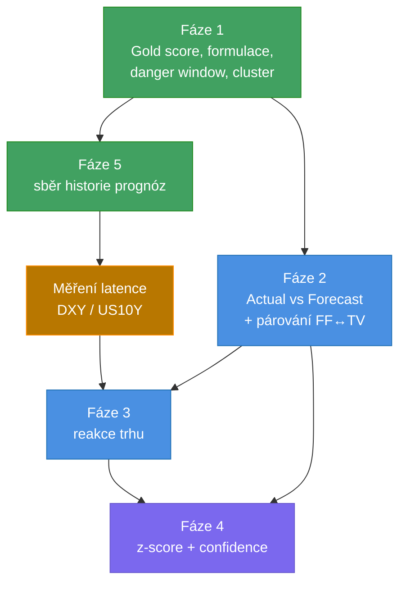

# Roadmap

Hodnocení současné verze a plán dalšího vývoje.

Tento dokument je oddělený od [README](README.md) záměrně: README popisuje, **co
bot dělá dnes**, roadmap popisuje, **kam má jít**. Nemíchat.

---

## Hodnocení současné verze

| Oblast | Hodnocení |
|---|---|
| Spolehlivost loopu | 9 / 10 |
| Ochrana proti duplicitám | 9 / 10 |
| Fallback zdroje | 8,5 / 10 |
| Discord UX | 9 / 10 |
| Časování | 9,5 / 10 |
| **Ekonomická logika** | **7 / 10** |
| **Predikce reakce zlata** | **6,5 / 10** |
| **Celkově** | **8,3 / 10** |

Infrastruktura je hotová věc. Prostor ke zlepšení **není** v Discordu ani ve
smyčce — je v tom, jak bot interpretuje ekonomické zprávy a jak odhaduje reálný
dopad na XAUUSD.

### Vodicí princip

> Největší chyba by byla snažit se z něj udělat jen „víc alertů“.
> Lepší je udělat z něj inteligentnější **economic-event engine**.

Každý bod níže se měří tímhle: přidává to *informaci*, nebo jen *text*?

---

## Zjištění, která mění plán

Před psaním kódu je potřeba vědět tohle — dvě věci z toho ruší nejpřímočařejší
způsob implementace.

### 1. Forex Factory neposílá `actual`

Ověřeno na živém feedu. Weekly JSON obsahuje **pouze**:

```
country, date, forecast, impact, previous, title
```

Žádné `actual`. **Celou fázi „Actual vs Forecast“ tedy na FF postavit nelze.**

TradingView `actual` má — ověřeno, vrací `actual`, `actualRaw`, `forecastRaw`,
`previousRaw`. Znamená to, že po vydání zprávy se musí sáhnout na TradingView
i v případě, že prognóza přišla z FF. Bot tak bude mít **dva zdroje pro dvě fáze
téže zprávy**, což vyžaduje párování eventů mezi zdroji (podle času a názvu,
názvy se mezi FF a TV liší — např. `JOLTS Job Openings` vs `JOLTs Job Openings`).

Tohle párování je hlavní netriviální práce fáze 2, ne samotný výpočet překvapení.

### 2. DXY a US10Y jsou dostupné bez klíče, ale latence je neznámá

Ověřeno na Yahoo Finance:

| Co | Symbol | Ověřená hodnota |
|---|---|---|
| Dolarový index | `DX-Y.NYB` | 99,591 (+0,16 %) |
| Výnos 10Y | `^TNX` | 4,768 (+0,21 %) |

Funguje bez API klíče, intradenní data přes `interval=1m`.

**Ale:** u indexů bývá Yahoo zpožděná (typicky ~15 min). Pro kontrolu reakce
30 sekund po zprávě je 15minutové zpoždění nepoužitelné. **Před implementací
fáze 3 se musí latence změřit** — porovnat Yahoo hodnotu proti známému
referenčnímu času. Když bude zpožděná:

- buď se posune okno měření na T+15 až T+20 min (pořád užitečné, jen ne okamžité),
- nebo běží tato část **lokálně na PC**, kde je MT5 s tick daty (ale pak to
  vyžaduje zapnutý počítač, což je proti celému návrhu),
- nebo se použije jiný zdroj s nižší latencí.

---

## Fáze 1 — vysoký přínos, malá práce

Tyhle čtyři body nepotřebují nový zdroj dat ani nový stav. Jde o interpretaci
toho, co bot už má.

### 1.1 Gold Impact Score

`impact` z Forex Factory **není** impact na zlato. FF hodnotí obecnou
významnost pro forex, ne pro XAUUSD. ADP je na FF `High`, ale zlatem hýbe
mnohem méně než NFP.

Přidat druhé skóre `0–10`, nezávislé na FF:

| Event | FF | Gold score |
|---|---|---|
| NFP | High | 10 |
| CPI | High | 10 |
| Fed Rate Decision | High | 10 |
| Powell (presser / testimony) | High | 9 |
| PCE | High | 9 |
| ISM Manufacturing / Services PMI | High | 7 |
| JOLTS Job Openings | Medium | 6 |
| ADP | High | 5 |
| Challenger Job Cuts | Medium | 3 |

V Discordu pak místo pouhého `High`:

```
🔥 GOLD IMPACT: 10/10
```

Implementace: lookup tabulka podle názvu, stejný mechanismus jako už existující
`gold_polarity()`. Fallback na FF impact, když název není v tabulce
(`High` → 6, `Medium` → 4), aby nová zpráva nikdy nespadla na `0`.

### 1.2 Přeformulovat směr na „běžnou reakci“

Současné `zlato PADÁ` tvrdí víc, než bot ví. Je to typická reakce, ne jistota.

```diff
- 📉 nad 55.2 → zlato PADÁ
+ 📉 nad 55.2 → běžná reakce: GOLD ↓
```

A po vydání zprávy:

```
📉 data podporují bearish reakci GOLD
```

Čistě textová změna, nulové riziko, výrazně přesnější. **Udělat první.**

### 1.3 Danger window

Bot dnes řekne „za 5 minut zpráva“. Neřekne, jak dlouho být opatrný.

```
⚠️ HIGH VOLATILITY WINDOW
14:20 → 14:50
```

Okno se počítá z Gold Impact Score: čím vyšší skóre, tím širší
(`10/10` → T-10 až T+20, `5/10` → T-5 až T+5). U clusteru se okna sjednotí.

### 1.4 Pojmenovat cluster

Seskupování zpráv se stejným časem už existuje, ale zpráva o nich mluví jako
o „3 zprávách“. To podceňuje situaci — tři labor-market data naráz nejsou tři
nezávislé eventy, je to jedna velká událost.

```
🔥🔥 NFP CLUSTER
3 klíčová labor-market data
Gold impact: EXTREME
```

Pressure = funkce součtu Gold Impact Score v clusteru, ne počtu zpráv.
Rozpoznat pojmenované clustery (NFP = Non-Farm + Average Hourly Earnings +
Unemployment Rate; CPI = CPI + Core CPI).

---

## Fáze 2 — druhá fáze zprávy: Actual vs Forecast

Tohle je největší upgrade. Dnes bot skončí ve chvíli, kdy zpráva vyjde — přesně
v momentě, kdy je informace nejcennější.

### 2.1 Follow-up po vydání

Po `T+0` sledovat, dokud se neobjeví `actual` (TradingView, polling ~30 s,
timeout ~10 min), a poslat druhou zprávu:

```
🔴 ISM Manufacturing PMI
Forecast: 55.2
Actual:   52.8
Previous: 55.6

📈 SURPRISE: -2.4
🟢 Počáteční bias pro GOLD: BULLISH
```

Opačný případ:

```
Actual: 57.1
📉 SURPRISE: +1.9
🔴 Počáteční bias pro GOLD: BEARISH
```

Znamení překvapení se otáčí podle už existující polarity (`INV` / `DIR`), takže
u `Unemployment Claims` platí, že vyšší `actual` = bullish pro zlato.

**Blokátor:** párování eventů mezi FF a TV (viz Zjištění 1).
**Stav:** nutné vyřešit párování, pak je zbytek přímočarý.

### 2.2 Velikost překvapení

`actual - forecast` samo o sobě nestačí. `55.2 → 55.3` a `55.2 → 48.1` jsou obojí
„pod/nad prognózou“, ale tržní význam je nesrovnatelný.

První verze — pásma:

```
< 0.2      🟢 velmi slabé
0.2 – 0.5  🟡 malé
0.5 – 1.0  🟠 střední
> 1.0      🔴 velké
```

**Pozor:** pásma musí být **per indikátor**. Jeden bod u PMI není jeden bod
u CPI, a `130K` u NFP není `130K` nikde jinde. Univerzální škála by dávala
nesmysly — to je hlavní past tohoto bodu.

---

## Fáze 3 — kontext trhu (DXY + US10Y)

Pro XAUUSD nerozhoduje jen zpráva, ale i reakce dolaru a výnosů. Tohle dává
botu možnost **zkontrolovat sám sebe**.

```
📊 POST-NEWS REACTION

DXY   +0,28 % ↑
US10Y +7 bp  ↑
GOLD  -0,41 % ↓

✅ reakce odpovídá makro směru
```

A když trh jde proti učebnici — což je ta cennější informace:

```
DXY   +0,28 % ↑
US10Y +7 bp  ↑
GOLD  +0,18 % ↑

⚠️ GOLD jde proti očekávané reakci
```

Tohle je nejlepší jednotlivý upgrade celého projektu: mění bota z „hlásiče
kalendáře“ na něco, co komentuje skutečné chování trhu.

**Blokátor:** latence Yahoo (viz Zjištění 2). Musí se změřit **před** stavbou.

---

## Fáze 4 — normalizace a confidence

Až po fázích 2 a 3. Bez nich není z čeho skládat.

### 4.1 Z-score místo pásem

```
surprise_z = (actual - forecast) / historical_std
```

```
SURPRISE Z-SCORE: +2,1
→ výrazně nad konsensem
```

Řeší to problém per-indikátorových pásem z bodu 2.2 elegantněji — normalizace
je automatická.

**Blokátor:** potřebuje `historical_std` na každý indikátor, tedy historii
odchylek `actual - forecast`. Ta nikde zdarma není. Dvě cesty:

- **Sbírat vlastní data** — bot začne ukládat každý `actual`/`forecast` do
  historie. Použitelné až po ~12 měřeních na indikátor, u měsíčních dat tedy
  **rok**. Levné, ale pomalé.
- **Externí zdroj** — obvykle platí se za něj.

Doporučení: **začít sbírat hned** (je to pár řádků do `state.json`), i když se
z-score zapne až později. Data, která se nesbírají, se nedají doplnit zpětně.

### 4.2 Confidence skóre

Ne z jednoho čísla. Složené z:

```
event importance  (Gold Impact Score, fáze 1.1)
+ surprise magnitude  (fáze 2.2 / 4.1)
+ historical reaction  (fáze 4.1 historie)
+ DXY reaction  (fáze 3)
+ US10Y reaction  (fáze 3)
```

```
NFP
Actual: 310K   Forecast: 180K
Surprise: +130K

DXY:   +0,32 %
US10Y: +8 bp

🔥 GOLD BIAS: BEARISH
Confidence: 91/100
```

**Poznámka k návrhu:** confidence nesmí být vycucané z prstu. Dokud nejsou
všechny složky reálně měřené, je lepší ji **nezobrazovat vůbec** než zobrazit
číslo, které nic neznamená. Falešná přesnost je horší než žádná.

---

## Fáze 5 — revize prognóz

Prognóza se před vydáním mění a bot dnes ukazuje tu z posledního stažení cache
(až hodinu starou). Řešení je z toho udělat funkci, ne bug.

Ukládat historii do `state.json` pod ID eventu:

```
Forecast history
09:00 → 55.0
13:00 → 55.2
15:00 → 55.3
```

```
📊 Forecast revision: +0,3
```

A když se prognóza změní po tom, co už odešel alert:

```
⚠️ ALERT UPDATED
Forecast changed: 55.2 → 55.4
```

Implementace: `state.json` už se commituje do repa, takže infrastruktura pro
historii existuje. Cache se stahuje raz za hodinu → přirozeně vzniká časová řada
bez jediného dotazu navíc.

---

## Doporučené pořadí



Zeleně: hotové do hodiny, bez nových závislostí.
Oranžově: měření, ne stavba — rozhoduje o proveditelnosti fáze 3.
Modře a fialově: vyžaduje předchozí fáze.

---

## Co záměrně nedělat

| Nedělat | Proč |
|---|---|
| Předpovídat směr z prognózy před vydáním | Už jednou tam bylo, protiřečilo si to s reakčním pravidlem a bylo to nečitelné. Trh reaguje na odchylku od prognózy, ne na prognózu. |
| Přidávat Low impact zprávy | Šum. Zlatem nehýbou a zaplavily by kanál. |
| Zobrazovat confidence, dokud nejsou měřené všechny složky | Falešná přesnost je horší než žádná. |
| Univerzální škálu překvapení | 1 bod u PMI ≠ 1 bod u CPI. Musí být per indikátor nebo normalizované. |
| Stavět fázi 2 na Forex Factory | Feed `actual` neobsahuje. Ověřeno. |
| Přesouvat cokoli na lokální PC | Celý smysl je, že počítač nemusí běžet. Platí i pro fázi 3. |
